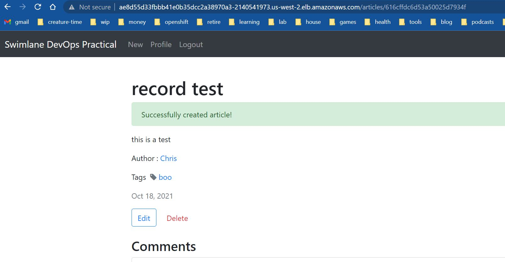

# Swimlane DevOps Practical

This is a demo application to use for an interview.



Notes:

- I did a Kustomize pattern instead of Helm because that's what I know.  I went down a bit of a Helm rabbit hole and decided to do this instead in the interest of time.  I might need to ramp up my Helm skills if this is desired.

- I skipped the Ansible task, but have notes as to why [here](ansible/README.md).

- I have some Terraform module design notes [here](terraform/modules/README.md) if you're curious why I chose the path I did.

- You can see some **Optimization Ideas** in the bottom section of this readme for a direction I'd likely take if I kept going with the build.  I'll probably poke at some of this if time permits, so let's talk about it if that's something you're curious about.

## Install

```bash
## Terraform
cd terraform/vpc
terraform plan -lock=false
terraform apply -lock=false -auto-approve

cd ../efs
terraform plan
terraform apply -auto-approve

## Login and push the image to ECR
aws ecr get-login-password --region us-west-2 | docker login --username AWS --password-stdin 353593603949.dkr.ecr.us-west-2.amazonaws.com

docker push 353593603949.dkr.ecr.us-west-2.amazonaws.com/swim:0.0.2

## ArgoCD Bootstrap (could be done by TF, ran out of time)

# connect to cluster, grab default argo pw, switch context
aws eks update-kubeconfig --name swim

# configure ArgoCD (add this repo)
kubectl apply -f argocd/workloads/argocd/argocd-cm.yaml

# create app-of-apps / deploy all workloads
helm template argocd/apps | kubectl apply -f -

# wait a few moments for the deployment, grab the URL and test
k get svc -n swim -o jsonpath="{.items[0].status.loadBalancer.ingress[0].hostname}"

```

## Docker Compose

```bash
docker-compose up

```

## Testing Locally

Make sure you have a mongodb instance to connect to if you're testing locally.  Either local install or Docker container.

```bash
git clone git://github.com/swimlane/devops-practical.git
npm install
cp .env.example .env
npm start

```

Then visit [http://localhost:3000/](http://localhost:3000/)


## Cleanup

```bash
helm template argocd/apps | kubectl delete -f -

cd terraform/efs
tf destroy

cd terraform/vpc
tf destroy

```

# Optimization Ideas

- Better ArgoCD bootstrap from Terraform

- ArgoCD Declarative setup

- Fix mongodb connection via env vars (for Docker Compose and EKS)

- Wrap Terragrunt around the solution for easier `tf apply` / `tf destroy` workflow.

- Implement ingress controller for `Ingress` types / less load balancers instead of `LoadBalancer` type.

- Implement cert-manager w/LE SSL certs for Ingress, TF R53 bits.

- Add proper ingress for ArgoCD, NodeJS app

- We could create an ECR module to tightly control repositories if necessary.  Swimlane uses Quay, so I skipped.  (plus time)

- Add auth to mongodb connection (need external secrets first)

- External secrets workload

- Add Monitoring (Prometheus, Grafana, Loki, Promtail stack)

- Istio if you want mTLS (for security points)

- Dig into MongoDB redundancy options
